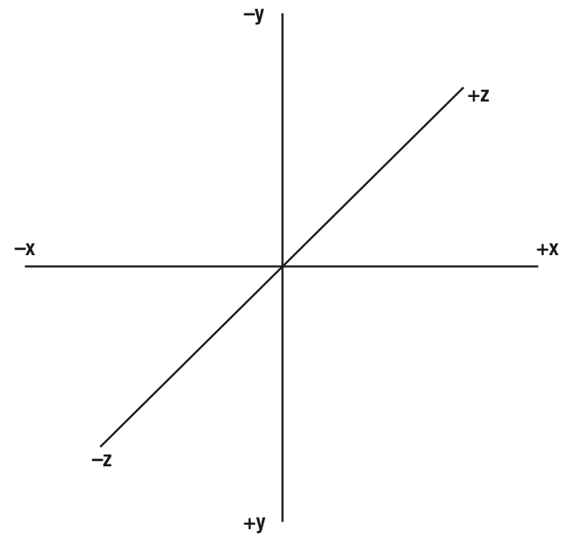
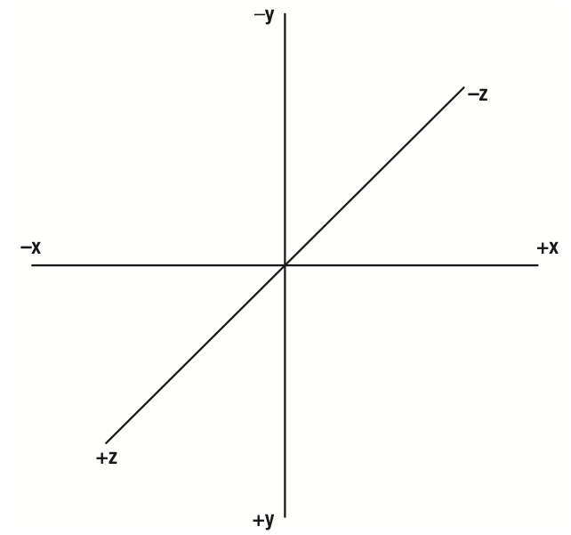
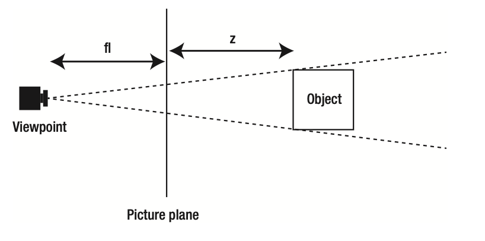

# 3D Animation

The main concept behind 3D is the existence of another dimension beyond the x and y axes. This is the dimension of depth, and it is usually labeled z.

The canvas element does not have a built-in z dimension, but it isn’t too difficult to create one with JavaScript.

## The z axis

To begin with, you must decide which direction the z-axis will go: in or out. it is in some ways opposite to most other commonly used coordinate systems. The y axis goes down instead of up, and angles are measured clockwise instead of counterclockwise.

If an object’s z position increases, is it going away from you or toward you on the z-axis? Neither way is necessarily more correct than the other. In fact, this subject has been addressed enough times that there are even names to describe the two methods: left-hand system and right-hand system.

### Right-hand Coordinate System



### Left-hand Coordinate System



## Perspective

Perspective is how we determine whether something is closer to us or farther away, or—to put it another way—how we make something look like it is closer or farther. There are a number of techniques for presenting perspective, but we concentrate on two here:

- Things get smaller as they get farther away.
- Things converge on a vanishing point as they get farther away.

You’ve probably seen examples of train tracks coming to a point on the horizon to illustrate the vanishing
point. So, when you move something on the z axis, you need to do two things:

- Scale it up or down.
- Move it closer to or farther away from the vanishing point.

### The perspective formula

Here, you have an object off in the distance, a viewpoint we look from (the camera), and a picture plane, which we look through to see the scene. You have the distance of the object to the picture plane, which is the z value, and, you have the distance from the viewpoint to the picture plane. This last one is similar to the focal length of a camera lens, so we use the variable fl to represent it. A long focal length can be compared to a telephoto lens on a camera, with a narrow view that compresses the distance between objects. A short focal length is like a wide-angle lens, where you see a lot of the scene, but with a lot of distortion. A medium focal length approximates what the human eye sees, and uses a value for fl that's between 200 and 300. Here’s the perspective formula:

```
 scale = fl / (fl + z)
```

This usually yields a number between 0.0 and 1.0, which is your ratio for scaling and converging on the vanishing point. However, as z approaches -fl, (fl + z) approaches 0 and scale approaches infinity. This is the coding equivalent to being poked in the eye.

What do you do with this scale value? Well, you can adjust the scale of the canvas context before drawing the object. For example, in the Ball class we've used throughout the book, there are scaleX and scaleY properties that are referenced in its draw method, like so:

```
 context.scale(this.scaleX, this.scaleY);
```

Let’s look at an example where we use 250 as the focal length. If z is zero—in other words, the object is exactly on the picture plane—then the scale will be 250 / (250 + 0). This comes out to exactly 1.0. That’s your scaleX and scaleY (remember that for scale, 1.0 means 100%). Multiplying 1.0 by the object’s x and y positions gives the same numbers back as a result, so the object’s screen position is exactly equal to its x and y.

Now move it out so that z is 250. That makes the scale equal to 250 / (250 + 250), or 0.5 for scaleX and scaleY. It also moves the object’s screen position. If the object were at 200, 300 on the x and y axis, its screen position would now be 100, 150—it has moved halfway to the vanishing point. (Actually, the screen position would be in relation to the vanishing point, which you see shortly.) 

Move z out to 9750. This makes the scale equal to 250/10000, or 0.025 for scaleX and scaleY. The object becomes just a speck that is close to the vanishing point.



