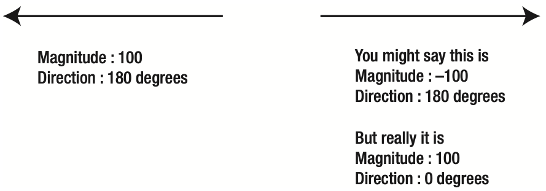
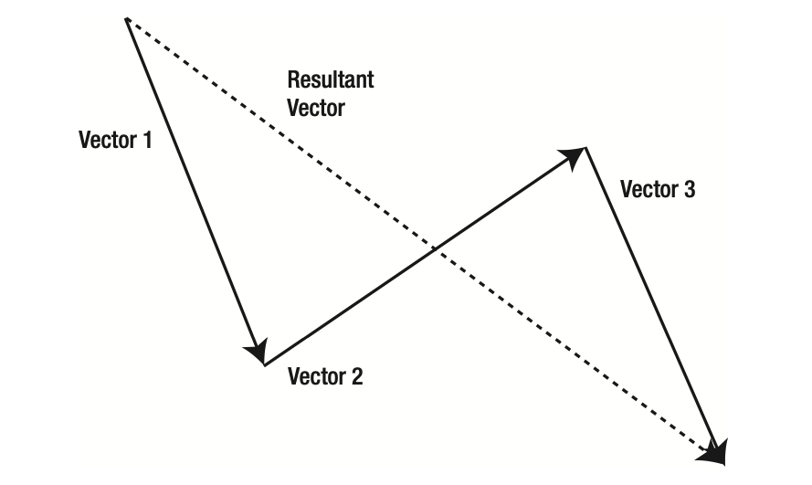

# Velocity and Acceleration

### Vectors and Velocity
A vector is something that has magnitude and direction. In the case of velocity, the magnitude is the speed. Vectors are drawn as arrows. The length of the arrow is its magnitude, and the direction the arrow is pointing in is, naturally, the direction of the vector.

It's important to understand that magnitude is always positive. Even a vector with a perceived negative
magnitude is just a vector going in the opposite direction.

Note that vectors don’t have any set position. Even in the case of velocity, the vector doesn’t state where something starts or where it ends; it just indicates how fast and in which direction the object is moving. Thus, two vectors can be equal if they have the same direction and magnitude.

### Velocity on one axis

The speed is just how many pixels it moves in that direction each frame. Thus, if the velocity on the x axis is 1, the object will move 1 pixel each frame from left to right. This also means that if the velocity is -1 on the x axis, it will move from right to left, 1 pixel each frame.

Already we are talking about a negative magnitude after you were just told there’s no such thing. Technically speaking, the velocity is actually 1 and the direction is 180 degrees. Similarly, a positive y velocity is that speed at 90 degrees

### Vector addition

Vector addition is when you have two vectors working in a system and you want to find the resultant overall vector. Here, you have a vector on the x axis, another vector on the y axis, and an overall velocity vector. You add vectors by simply placing them together head to tail. The resultant vector is the line you can draw from the starting point of the first vector on the chain to the ending point of the last one.

### Acceleration

Like velocity, acceleration is described as a value and a direction. However, whereas velocity changes the position of an object, acceleration changes its velocity.

### Convert angular velocity to x, y velocity
   vx = speed * Math.cos(angle);
   vy = speed * Math.sin(angle);

### Convert angular acceleration (any force acting on an object) to x, y acceleration
   ax = force * Math.cos(angle);
   ay = force * Math.sin(angle);

### Add acceleration to velocity
   vx += ax;
   vy += ay;

### Add velocity to position
   object.x += vx;
   object.y += vy;